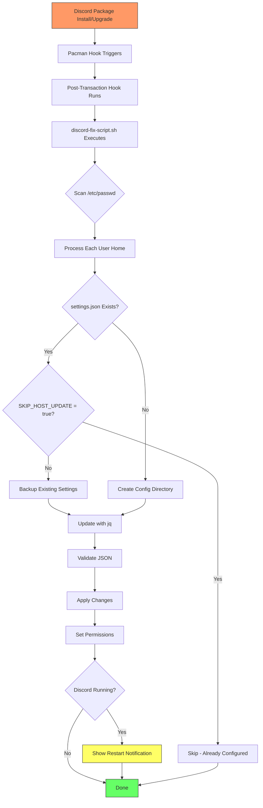
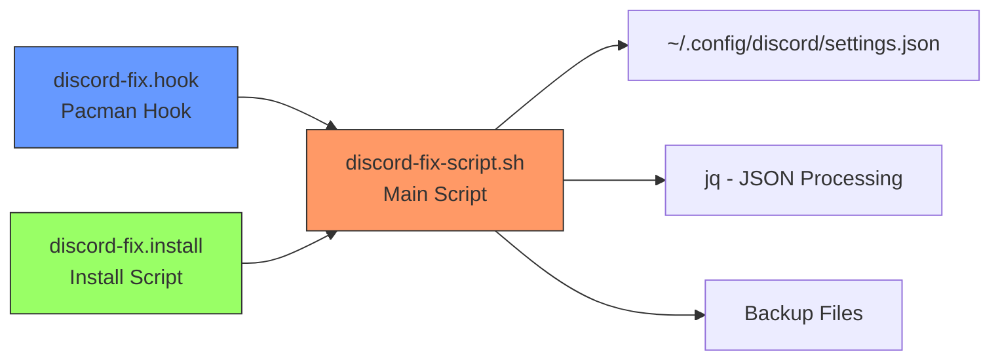

# discord-fix

[](https://github.com/weselben/discord-fix/actions)
[](https://github.com/weselben/discord-fix/releases/latest)
[](LICENSE)
[](https://archlinux.org)

A lightweight pacman hook package that automatically configures Discord to skip forced updates on Arch Linux.

## 🎯 Problem

Discord on Linux periodically forces updates that can break the application or interrupt your workflow. This package automatically sets `SKIP_HOST_UPDATE=true` in Discord's user settings to prevent this behavior.

## ✨ Features

- **Automatic Configuration** - Pacman hook triggers after Discord installation/upgrades
- **Non-Invasive** - Only modifies user-space config, never touches Discord binaries
- **Safe** - Creates timestamped backups before modifying settings
- **Idempotent** - Won't reconfigure already-correct settings
- **Multi-User Aware** - Configures settings for all user accounts on the system
- **JSON Validation** - Uses `jq` for safe, validated JSON manipulation
- **Verbose Output** - Clear console output showing exactly what's happening

## 📦 Installation

### Option 1: Custom Pacman Repository (Recommended)

Add the repository to `/etc/pacman.conf`:

```ini
[discord-fix]
SigLevel = Optional TrustAll
Server = https://weselben.github.io/discord-fix/$arch
```

Then install:
```bash
sudo pacman -Sy discord-fix
```

### Option 2: Quick Install (GitHub Releases)

```bash
curl -s https://api.github.com/repos/weselben/discord-fix/releases/latest | grep -Eo 'https://[^"]+\.pkg\.tar\.zst' | head -1 | xargs curl -L -o /tmp/pkg.tar.zst && sudo pacman -U /tmp/pkg.tar.zst
```

### Option 3: Build from Source

```bash
git clone https://github.com/weselben/discord-fix.git
cd discord-fix
makepkg -si
```

## 🔧 How It Works



### Component Overview



## 📋 What It Does

The package sets the following in your Discord settings:

```json
{
  "SKIP_HOST_UPDATE": true
}
```

All other settings are preserved. A timestamped backup is created before any modification:

```
~/.config/discord/settings.json.discord-fix-backup-YYYYMMDDTHHMMSS
```

## 🔍 Verification

After installation, verify the setting was applied:

```bash
cat ~/.config/discord/settings.json | jq .SKIP_HOST_UPDATE
# Should output: true
```

## 🚨 Troubleshooting

### Discord still updates

1. Ensure the package is installed: `pacman -Q discord-fix`
2. Check if Discord is running: `pgrep -x Discord`
3. Restart Discord after package installation
4. Verify the setting: `jq .SKIP_HOST_UPDATE ~/.config/discord/settings.json`

### Settings not applied

Manually run the script:

```bash
sudo /usr/lib/discord-fix/discord-fix-script.sh
```

### Restore from backup

```bash
cp ~/.config/discord/settings.json.discord-fix-backup-YYYYMMDDTHHMMSS ~/.config/discord/settings.json
```

## 📊 Dependencies

| Dependency | Purpose |
|------------|---------|
| `discord` | The Discord application |
| `bash` | Script runtime |
| `jq` | JSON processing and validation |
| `procps-ng` | Process detection for restart notifications |

## 🤝 Contributing

Contributions are welcome! Please follow these steps:

1. Fork the repository
2. Create a feature branch (`git checkout -b feature/amazing-feature`)
3. Commit your changes using [Conventional Commits](https://www.conventionalcommits.org/)
4. Push to the branch (`git push origin feature/amazing-feature`)
5. Open a Pull Request

### Development Setup

```bash
git clone https://github.com/weselben/discord-fix.git
cd discord-fix
makepkg -s  # Install dependencies and build
```

### Pre-Commit Hooks

The repository includes pre-commit hooks that verify:
- PKGBUILD checksum validity
- Arch packaging guidelines compliance

## 📄 License

This project is licensed under the MIT License - see the [LICENSE](LICENSE) file for details.

## ⚖️ Disclaimer

This package modifies Discord's user settings only. It does not modify, reverse engineer, or redistribute Discord itself. Discord is a trademark of Discord Inc. This package is not affiliated with or endorsed by Discord Inc.

## 🔗 Links

- [GitHub Repository](https://github.com/weselben/discord-fix)
- [Issue Tracker](https://github.com/weselben/discord-fix/issues)
- [Latest Release](https://github.com/weselben/discord-fix/releases/latest)

## 🎖️ Acknowledgments

- Arch Linux community for packaging guidelines
- Discord team for the application (despite the forced updates 😉)
